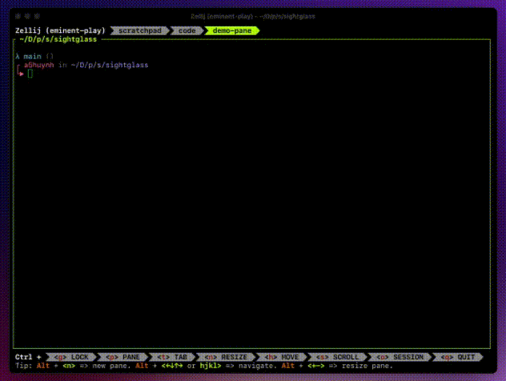

# memex

Super simple "memory" for LLM projects, semantic search, etc.

<p align="center">
    
</p>

## Running the service

Note that if you're running on Apple silicon (M1/M2/etc.), it's best to run natively (and faster)
since Linux ARM builds are very finicky.

``` bash
# Build and run the docker image
> docker compose up
# OR run natively in you have the rust toolchain installed.
> cp .env.template .env
> cargo run --release -p memex
```

## Add a document

``` bash
> curl http://localhost:8181/collections/test \
    -H "Content-Type: application/json" \
    --data @example_docs/state_of_the_union_2023.json
{
    "task_id": 1,
    "collection": "test",
    "status": "Queued",
    ...
}
```

Feel free to add as many documents as you want. Each one will be enqueued and processed
as they are added.

Wait a couple seconds per document to be processed. You can check the status
using the `task_id` above like so:

## Check task status

``` bash
> curl http://localhost:8181/tasks/1
{
    "task_id": 1,
    "status": "Processing"
}
```

One the task is shown as "Completed", you can now run a query against the doc(s)
you've just added.

## Run a query

``` bash
> curl http://localhost:8181/collections/test/search \
    -H "Content-Type: application/json" \
    -X GET \
    -d "{\"query\": \"what does Biden say about taxes?\", \"limit\": 3}"
[{
    "id": <internal_document_id>,
    "segment": <document section>,
    "content": <content block>,
    "score": <relevancy score>
}, ...]
```

You'll